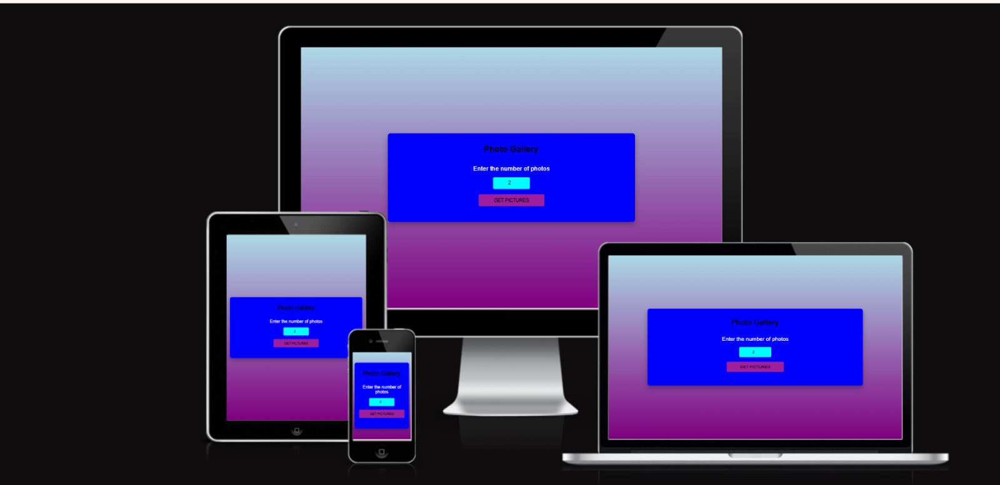

# 📸 Photo Gallery App


A simple and beautiful **Photo Gallery web app** that lets users generate a gallery of random images by entering the number of photos they want to see. Built with **HTML, CSS, and JavaScript** and deployed on **GitHub Pages**.

---

## ✨ Features

- 🎯 Enter a number (1–20) to generate that many images  
- 🔄 Smooth loading spinner while images are being fetched  
- 🖼️ Responsive image grid gallery  
- ⚠️ Friendly error handling for invalid inputs  
- 🚀 Works perfectly on GitHub Pages (no API keys required)  
- 📱 Mobile-friendly layout  

---

## 🛠️ Tech Stack

- **HTML5** – Structure  
- **CSS3** – Styling & animations  
- **JavaScript (Vanilla JS)** – Logic & API handling  
- **Picsum Photos API** – Random images (no authentication required)  
- **GitHub Pages** – Hosting  

---

## 📂 Project Structure


---

## 🚀 Live Demo

🔗 **View Live Site:**  
https://princessble.github.io/photo-gallery/

---

## 📱 Responsive Design

This project is responsive and adapts smoothly to different screen sizes (mobile, tablet, desktop).

<p align="center">
  
  
</p>

**How responsiveness is achieved:**
- CSS Grid for the gallery layout  
- Flexible widths and spacing  
- Images scale using `width: 100%` and `object-fit: cover`  
- Spinner stays centered on all screen sizes  

---

## ⚙️ Workflow

This is the workflow I followed to build the project from start to finish:


**Steps:**
1. Planned the UI and user flow  
2. Built the HTML structure  
3. Styled the layout with CSS  
4. Added interactivity with JavaScript  
5. Implemented loading states and error handling  
6. Tested responsiveness on multiple screen sizes  
7. Deployed to GitHub Pages  

---

## ✅ HTML Validator (W3C)

I validate my HTML to ensure it follows web standards and best practices.


- Validator: https://validator.w3.org/  
- Method used: Validate by URL / File Upload / Direct Input  

---

## ✅ CSS Validator (W3C)

I validate my CSS to ensure it is clean and standards-compliant.


- Validator: https://jigsaw.w3.org/css-validator/  
- Method used: By URL / File Upload / Direct Input  

---

## 🧪 How To Run Locally

```bash
git clone https://github.com/princessble/photo-gallery.git
cd photo-gallery